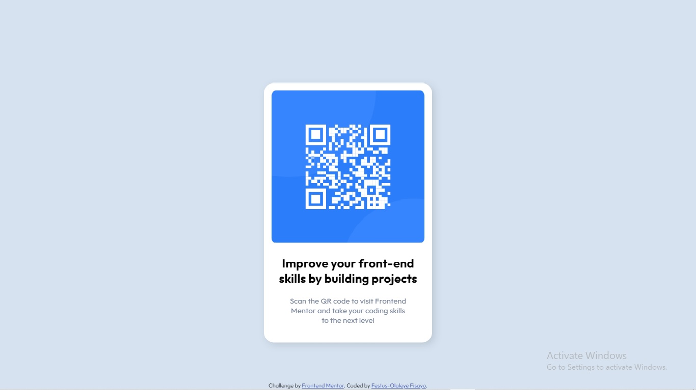

# qr-code

## Table of contents

- [Overview](#overview)
  - [Screenshot](#screenshot)
  - [Links](#links)
- [My process](#my-process)
  - [Built with](#built-with)
- [Author](#author)

## Overview

### Screenshot

### Links

- Solution URL: [Github repository](https://github.com/OlaleyeFisayo)
- Live Site URL: [Github pages](https://olaleyefisayo.github.io/qr-code/)

## My process

### Built with

- Semantic HTML5 markup
- CSS custom properties

## Author

- Website - [OlaleyeFisayo](https://github.com/OlaleyeFisayo)
- Frontend Mentor - [@OlaleyeFisayo](https://www.frontendmentor.io/profile/OlaleyeFisayo)

